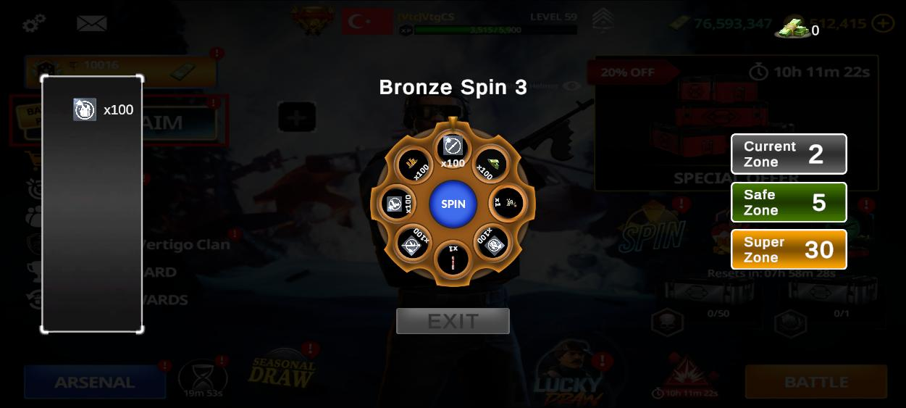
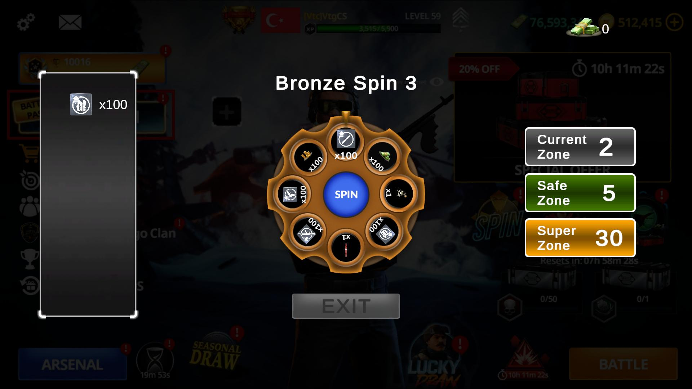
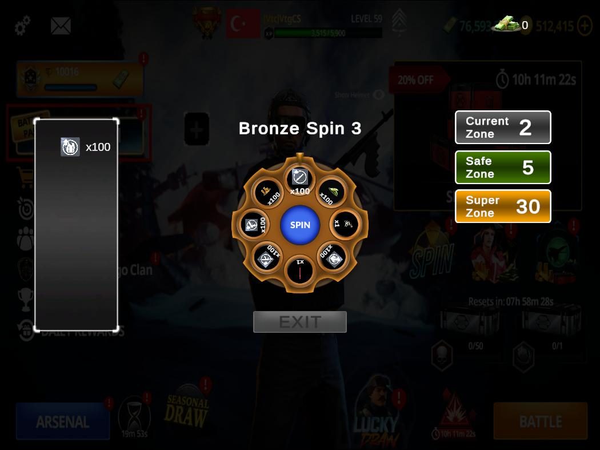

# 🎡 Wheel of Fortune - Vertigo Games Case Study

This project is a robust implementation of a "Wheel of Fortune" mobile game mechanic, developed as a technical case study for Vertigo Games. It features zone-based progression, a risk/reward system with Bomb/Revive mechanics, dynamic reward distribution, and a clean, maintainable codebase following SOLID principles.

---

## 📱 UI Responsiveness & Aspect Ratio Tests
The UI is engineered to maintain visual integrity across extreme aspect ratios using Unity's Canvas Scaler and custom anchor setups.

## Gameplay Demo
https://github.com/user-attachments/assets/5e3a6dd5-89c5-4406-a111-f0fa7abbb37b


| 20:9 (Modern Phones) | 16:9 (Standard) | 4:3 (Tablets) |
| :---: | :---: | :---: |
|  |  |  |

---

## 🎮 Game Mechanics

### Zone System
The game features a progressive zone system with three distinct types:
- **Bronze Zones (Normal):** Zones 1-4, 6-9, 11-14, etc. - Standard gameplay
- **Silver Zones (Safe):** Every 5th zone (5, 10, 15, 20, 25...) - Better rewards, no bombs
- **Golden Zones (Super):** Every 30th zone (30, 60, 90...) - Premium rewards, no bombs

### Wheel Types
Each zone type uses a different wheel configuration:
- **Bronze Wheel:** Used in normal zones
- **Silver Wheel:** Used in safe zones with improved reward distribution
- **Golden Wheel:** Used in super zones with the best rewards

### Reward Types
The game includes 8 distinct reward types:
1. **Cash:** In-game currency
2. **Gold:** Premium currency
3. **Points:** Experience points
4. **Armor:** Defensive equipment
5. **Weapon:** Offensive equipment
6. **Consumable:** Usable items
7. **Chest:** Random reward containers
8. **Random Item:** Randomized item rewards

### Bomb & Revive Mechanics
- When a player hits a **Bomb**, they are presented with revival options
- **Money Revive:** Revive using cash (cost increases exponentially: 1000$ → 2000$ → 4000$...)
- **Ads Revive:** Revive by watching an advertisement (simulated)
- **Give Up:** End the game and lose all uncollected rewards

### Exit Rules
Players can only exit and save their rewards when:
- Currently in a **Safe Zone (Silver)** or **Super Zone (Golden)**
- The wheel is not spinning (Idle state)

---

## 🛠 Technical Architecture & Features

This project adheres to **SOLID principles** and maintains clean separation between Logic, Data, and Presentation layers.

### 🔹 Core Systems

#### 1. **ScriptableObject-Driven Architecture**
- All zone configurations, wheel data, and reward settings are data-driven
- Easy to balance and modify without touching code
- Supports rapid iteration and testing

#### 2. **Event-Driven Communication**
- Managers communicate via C# Actions and Events
- Decoupled systems reduce dependencies
- Events: `OnSpinStarted`, `OnSpinCompleted`, `OnZoneChanged`, `OnBombHit`, etc.

#### 3. **Namespace Organization**
All scripts are properly organized into namespaces:
```csharp
GameSystem          // Game state management
SpinSystem          // Wheel spinning mechanics
ZoneSystem          // Zone progression
WheelSystem         // Wheel data structures
RewardSystem        // Reward distribution
SaveSystem          // PlayerPrefs-based persistence
BombSystem          // Bomb handling and revive logic
ConfigSystem        // Configuration ScriptableObjects
UI                  // UI controllers
```

#### 4. **Singleton Pattern for Managers**
- `GameStateManager`: Controls game flow (Menu, Playing, GameOver, Victory)
- `WheelManager`: Loads and manages wheel configurations
- `ZoneManager`: Tracks zone progression and determines zone types
- `SpinController`: Manages spin states and coordinates spin flow
- `BombHandler`: Handles bomb hits and revive mechanics
- `SaveManager`: Persists rewards using PlayerPrefs with JSON serialization

### 🔹 Code Quality & Optimizations

#### Clean Code Practices
- **Consistent Naming:** Clear, descriptive variable and method names
- **Single Responsibility:** Each class has one clear purpose
- **Dependency Injection:** SerializeField references instead of FindObjectOfType

#### Performance Optimizations
- **DOTween Integration:** Smooth, performant animations for wheel spinning and UI transitions
- **Event Unsubscription:** Proper cleanup in OnDestroy to prevent memory leaks
- **Efficient UI Updates:** Only update UI elements when state changes occur

#### Maintainability
- **Modular Design:** Easy to add new reward types or wheel configurations
- **ScriptableObject Configs:** Game balance changes without code modifications
- **Clear Separation of Concerns:** UI, Logic, and Data are completely separate

### 🔹 Key Features Implemented

✅ **Zone Progression System**
- Automatic zone advancement after successful spins
- Dynamic wheel loading based on current zone type
- Visual feedback for zone transitions

✅ **Deterministic Wheel Mechanics**
- Precise angle calculations for each slice
- Consistent reward selection and display
- Smooth rotation animations with DOTween

✅ **Bomb & Revive System**
- Dynamic revive cost calculation (exponential multiplier)
- Money validation before allowing revive
- Revive counter reset on new game

✅ **Save/Load System**
- Rewards saved to PlayerPrefs in JSON format
- Automatic loading on game start
- Persistent inventory across sessions

✅ **Comprehensive UI System**
- Reward display with icons and multipliers
- Cash counter with animated updates
- Zone indicator with visual distinction for safe/super zones
- Bomb panel with revive options
- Exit panel with collect/continue options


## 🚀 Installation & Setup

### Requirements
- Unity 2022.3 or higher
- TextMeshPro package
- DOTween (Free or Pro)

### Setup Steps
1. Clone or download the repository
2. Open the project in Unity Hub
3. Ensure all required packages are imported
4. Open the main scene from `Assets/_Game/Scenes`
5. Press Play to start the game


---

## 📊 Game Flow

1. **Game Start**
   - Zone resets to 1
   - Revive counter resets
   - Previous rewards cleared
   - Bronze wheel loaded

2. **Spin Cycle**
   - Player clicks "Spin" button
   - Wheel rotates with animation
   - Random slice selected
   - Result processed (Reward or Bomb)

3. **Reward Collection**
   - Reward added to player's list
   - UI updated with reward icon
   - Zone advances by 1
   - New wheel loaded if zone type changed

4. **Bomb Hit**
   - Bomb panel appears
   - Player chooses: Money Revive, Ads Revive, or Give Up
   - Money Revive: Validates cash and deducts cost
   - Ads Revive: Simulates ad watching
   - Give Up: Game restarts, rewards lost

5. **Exit Game**
   - "Collect and Exit" button enabled in Safe/Super zones
   - Rewards saved to PlayerPrefs
   - Game automatically restarts

---

## 🧪 Testing & Verification

All core features have been thoroughly tested:

✅ Zone progression and wheel transitions  
✅ Reward collection and display  
✅ Bomb mechanics and revive system  
✅ Save/Load functionality  
✅ UI updates and animations  
✅ Wheel spinning and slot selection  
✅ Safe/Super zone detection  
✅ Money revive validation  
✅ Dynamic revive cost calculation  

---

## 📝 Notes

- The game uses a **deterministic wheel system** for consistent results
- All animations are powered by **DOTween** for smooth performance
- **Event-driven architecture** ensures systems remain independent
- **ScriptableObject** usage allows game balance adjustments via Unity Editor

---

## 👨‍💻 Developer

**Adilcan Topuz**  
Case Study - Vertigo Games
---

